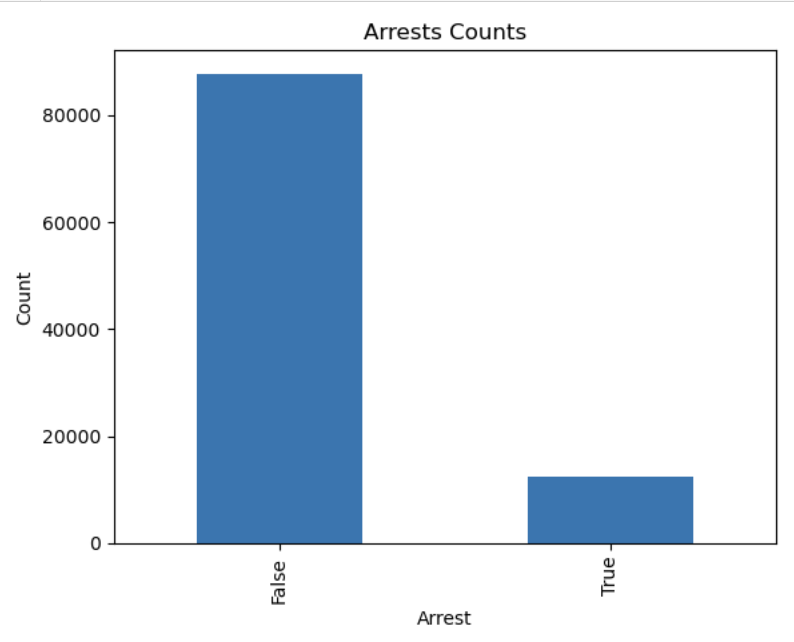
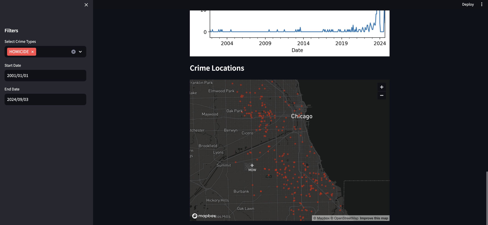

##  1. Chicago Crime Analysis

- Prepared for UMBC Data Science Master Degree Capstone by Dr Chaoji (Jay) Wang - Fall 2024 Semester
- Author: Vamsi Kasukurthi
- GitHub : https://github.com/v-kasukurthi
- Linkedin : https://www.linkedin.com/in/vamsi-kasukurthi-648395191/
- Presentation : https://github.com/v-kasukurthi/UMBC-DATA606-Capstone/blob/main/docs/capstone.pptx
- Youtube Video: 

## 2. Background
### What is it about? 
The project is about using chicago crime data to model and understand crime patterns in Chicago. This involves:
1. Identifying trends over time (e.g., by type of crime, location, or season).
2. Using statistical or machine learning techniques to predict crime occurrences.
3. Understanding correlations between various factors (e.g., socioeconomic conditions, neighborhood features) and crime rates.
### Why does it matter? 
It helps local authorities allocate resources more effectively (e.g., police presence). Understanding crime patterns can aid in policymaking to reduce crime rates. It contributes to improving public safety by providing insights into when and where crimes are more likely to occur. Predictive models can be used in urban planning and community development to mitigate factors that may lead to higher crime rates.
### Research Questions:
1. What types of crimes are most frequent in specific neighborhoods of Chicago?
2. Are there time-based patterns (e.g., certain crimes happening more at night or during specific seasons)?
3. What socioeconomic or environmental factors contribute most significantly to crime?
4. Can spatial analysis identify accident hotspots, and how do traffic volume and speed limits relate to crash rates?
5. Can crime be accurately predicted using historical data and various machine learning algorithms?

## 3. DATA
Description : 

1. Data Source : *[Chicago Data Portal](https://data.cityofchicago.org/Transportation/Traffic-Crashes-Crashes/85ca-t3if/data](https://data.cityofchicago.org/Public-Safety/Crimes-2001-to-Present/ijzp-q8t2/about_data)*. :link:

2. Data Size : 1.7 GB

3. Data Shape
   > - Number of columns =  22
   > - Number of rows    = 8.15M

4. Time period (2001 - present)
5. What does dataset represent - This dataset reflects reported incidents of crime (with the exception of murders where data exists for each victim) that occurred in the City of Chicago from 2001 to present, minus the most recent seven days.
6. Data Dictionary
   
### 3.1 Data Dictionary

| **Column Name**                        | **Description**                                                                    |
|----------------------------------------|------------------------------------------------------------------------------------|
| `ID`                              | Unique identifier for the record.                                   |
| `Case Number`                     | The Chicago Police Department RD Number (Records Division Number), which is unique to the incident.                           |
| `DATE`                            | Date when the incident occurred. this is sometimes a best estimate.                                      |
| `Block`                           | The partially redacted address where the incident occurred, placing it on the same block as the actual address.                                          |
| `IUCR`                            | The Illinois Unifrom Crime Reporting code. This is directly linked to the Primary Type and Description. See the list of IUCR codes at https://data.cityofchicago.org/d/c7ck-438e.                      |
| `Primary Type`                    | The primary description of the IUCR code                                           |
| `Description`                     | The secondary description of the IUCR code, a subcategory of the primary description.                                       |
| `Location Description`            | Description of the location where the incident occurred.                                             |
| `Arrest`                          | Indicates whether an arrest was made.                                             |
| `Domestic`                        | Indicates whether the incident was domestic-related as defined by the Illinois Domestic Violence Act.                                       |
| `Beat`                            | Indicates the beat where the incident occurred. A beat is the smallest police geographic area – each beat has a dedicated police beat car. Three to five beats make up a police sector, and three sectors make up a police district.                                             |
| `District`                        | Indicates the police district where the incident occurred.                                |
| `Ward`                            | The ward (City Council district) where the incident occurred                                   |
| `Community Area`                  | Indicates the community area where the incident occurred. Chicago has 77 community areas.                                    |
| `FBI Code`                        | Indicates the crime classification as outlined in the FBI's National Incident-Based Reporting System (NIBRS).                                               |
| `X Coordinate`                    | The x coordinate of the location where the incident occurred in State Plane Illinois East NAD 1983 projection. This location is shifted from the actual location for partial redaction but falls on the same block.                                          |
| `Y Coordinate`                    | The y coordinate of the location where the incident occurred in State Plane Illinois East NAD 1983 projection. This location is shifted from the actual location for partial redaction but falls on the same block.                                       |
| `Year`                            | Year the incident occurred.                                       |
| `Updated on`                      | Date and time the record was last updated                                          |
| `Latitude`                        | The latitude of the location where the incident occurred. This location is shifted from the actual location for partial redaction but falls on the same block.                                           |
| `Longitude`                       | The longitude of the location where the incident occurred. This location is shifted from the actual location for partial redaction but falls on the same block.                          |
| `Location`                        | The location where the incident occurred in a format that allows for creation of maps and other geographic operations on this data portal. This location is shifted from the actual location for partial redaction but falls on the same block.                                           |

### 3.2 Target Variable

- **'Arrest'**: Indicates whether the criminal is arrested or not in that particular crime.

### 3.3 Selected Features/Predictors for the ML Models

The following columns are selected as features (predictors) to train the ML models:
- **'Case Number'**: The Chicago Police Department RD Number (Records Division Number), which is unique to the incident.
- **'IUCR'**: The Illinois Unifrom Crime Reporting code. This is directly linked to the Primary Type and Description. See the list of IUCR codes at https://data.cityofchicago.org/d/c7ck-438e.
- **'Primary Type'**: The primary description of the IUCR code.
- **'Domestic'**: Indicates whether the incident was domestic-related or not.
- **'FBI Code'**: Indicates the crime classification as outlined in the FBI's National Incident-Based Reporting System (NIBRS).
- **'Description'**: Short description of the type of crime
- **'Description'**: Short description of the type of crime
- **'Location description'**: Description of where crime occured
- **'District'**: District code where crime occured
- **'Community'**: Community area code where crime occured
- **'Longitude & Latitude'**: Exact coordinates of crime occurance
- **'Year'**: Year of crime

## 4. Exploratory Data Analysis

### 4.1 Data Cleansing and Preprocessing:
The original dataset consists of 8.15M rows. For ease-of-use, only a chunk of the original data is taken for the analysis. The chunk size is 100,000 rows. The null values are mostly in the location related columns like X-coordinate, Y-coordinate, Latitude and Longitude. These are filled with 0 using the fillna() method.There are no duplicate rows present in the dataset as each row is a unique case.

### 4.2 Data Visualization:
**Univariate Analysis**:
  The distribution of the target variable, `Arrest`, was analyzed to assess how the arrests are distributed in the data. Using the `value_counts()` function, occurrences of each arrests (True or False) were calculated. A bar plot was generated, where the x-axis represents arrests were made or not, and the y-axis shows the frequency of each category.
  This visualization helps us quickly assess the proportion of cases with arrests 'True' compared to those without 'False'.

**Bivariate Analysis**:
   The goal of this bivariate analysis is to investigate whether the geographic area 'Beat' in which a crime occurs has any relationship with whether an 'Arrest' was made. The x-axis is based on the 'Arrest' column, which contains True or False values, representing whether an arrest was made. The y-axis represents the 'Beat' column, which is a numeric code representing a specific geographic area within a police district. This analysis helps us answer questions like whether certain beats more likely to have arrests or not.
   - The position of the median lines in each box shows whether the distribution of beats differs significantly between cases with and without arrests. We can clearly see that there is no difference in the distribution of 'Beats' between cases with and without arrests.
   - The size of the boxes and the length of the whiskers indicate the spread (variability) of beat numbers. A wider spread indicates more variation in the beat numbers where arrests were made or not made. Here we can observe similar variation in the 'Beat' numbers in both the cases.

**Crimes by Location**:
   - We have plotted number of crimes happened in the specific locations using bar graph. The x-axis denotes the number of crimes happened. The y-axis denotes the place of the crime.

**Distribution of Crime Types**:
   - You can see the most common and least common crime types. This can provide insights into the prevalent types of crime in the area. The x-axis indicates the length of each bar corresponds to the number of occurrences (or frequency) of that particular crime type. The y-axis indicates the crime type. If certain types of crimes (e.g., theft or assault) are disproportionately frequent, it may indicate areas where law enforcement resources should be focused.

**Distribution of the Community Area**:
   - This is a histogram with a kernel density estimate (KDE) to visualize the distribution of the "Community Area" variable from the dataset. Each bar represents the count of occurrences for a specific range of community areas. The height of each bar corresponds to the number of crimes that occurred in that particular community area. The smooth KDE line overlaid on the histogram gives a clearer sense of the overall distribution. The peaks of this line represent areas with a higher density of occurrences.
   - This visualization helps to understand the geographic distribution of incidents (like crimes) across different community areas. By looking at how the incidents are spread, you can identify which areas are more prone to specific incidents. This can help to deploy more forces to that particular community areas to reduce the number of crimes.

## 5. Model Training and Evaluation

### 5.1 Models Used for Predictive Analysis
1. **Logistic Regression Classifier**
2. **Decision Tree Classifier**
3. **KNN Model**

### 5.2 Training Methodology
1. **Data Splitting**: Dataset was split into **80% training** and **20% testing** to allow the model to generalize on unseen data.
2. **Python Packages**: 
   - **scikit-learn**: Model training, evaluation, and tuning.
   - **pandas** and **NumPy**: Data manipulation.
   - **Matplotlib** and **Seaborn**: Visualization for EDA insights.
3. **Development Environment**: Jupyter Notebook for computational support, GitHub for version control.

### 5.3 Model Evaluation
After hypertuning and adjusting the paramters, the results of the models accuracy are as follows:
- **Logistic Regression**: Displayed a balanced performance with **92.53%** training accuracy and **92.72%** testing accuracy, suggesting minimal overfitting and stable generalization.
- **Decision Tree**: Demonstrated mild overfitting with **92.46%** training accuracy and **92.37%** testing accuracy. Generates same as Logistic Regression model.
- **K-Nearest Neighbors (KNN)**: Achieved an accuracy across training and testing datasets with **91.55%** accuracy, indicating the same results as the previous models.

### Best Model Selection
Based on post-tuning results, **Logistic Regression** was selected as the best model with a testing accuracy of **92.72%**, providing the most balanced performance across training and testing datasets.

## 6. Web Application Development

A user-friendly web application was built using **Streamlit** to make the model accessible and interactive. Key features include:
1. **User Input**: Fields for selecting particular crime types and also to choose specific date range.
2. **Prediction Output**: After processing the input data, the app displays the contours at the locations where the crime has been occured.

## 7. Conclusion
- Analysing Chicago's crime data revealed a complex interplay of factors influencing fluctuations in crime rates.
- Community policing initiatives, technology adoption, violence reduction programs, and changes in criminal justice policies further shape the landscape of crime in the city. Economic conditions, including both booms and crises, also play a significant role.
- Ultimately, understanding Chicago's crime dynamics requires a multifaceted approach encompassing historical data, community dynamics, law enforcement strategies, and socioeconomic factors.

### Future Developments
- The web app can be improvised with the crime records for the ease of access to police officers as well as crime department analysts to avoid crimes happening in the future.
- Along with the dataset of Chicago city, various metropolitan cities crime data can be inserted into the model so that similarities between the crimes in different states can be observed.

## 8. References
Chicago Data Portal
- Data Source Link: https://data.cityofchicago.org/Public-Safety/Crimes-2001-to-Present/ijzp-q8t2/about_data
